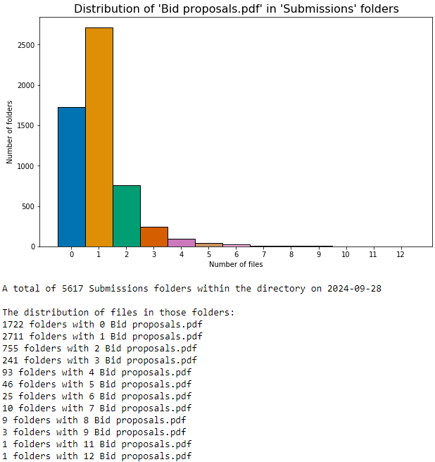

# Data import and EDA
For getting data, and expolratory data analysis

### [Files and Folders Pattern Matching](#Files-and-Folders-Pattern-Matching)
This Python script provides functionality to traverse a directory, search for specific folders and files based on regex patterns, and analyze the distribution of those files. It is useful for exploring directory structures, collecting file information, and visualizing the distribution of files within folders.

### [Null Percentage Table Function](#Null-Percentage-Table-Function)
This Python script checks data quality calculating the percentage of missing (null) values in each column of a DataFrame and returns the result in a formatted table.

---

# Files and Folders Pattern Matching

## Overview

The main class in this script is `FilesAndFoldersInDirectory`, which contains methods for traversing a directory, matching folders and files based on user-defined patterns, and performing various operations such as counting, sampling, and visualizing the data.

### Key Features:
- **Pattern-based directory traversal:** Search for folders and files using regular expressions.
- **Limit the search:** Stop the search once a certain number of matches (limit) are found.
- **File distribution analysis:** Visualize the distribution of files in matching folders.
- **Random sampling of matched files:** Output a random sample of files and folders.
- **Random folder selection:** Pick a folder containing a specific number of files and display its contents.

---

## Setup and Installation

### Prerequisites
```python
  # Python 3.x
  # required libraries:
  import os
  import re
  import random
  from collections import defaultdict
  import pandas as pd
  import matplotlib.pyplot as plt
  import numpy as np
  import seaborn as sns
```

You can install these dependencies via `pip`:

```bash
pip install pandas matplotlib seaborn numpy
```

### Usage Instructions

1. **Clone the Repository:**
   Clone the repository to your local machine:

   ```bash
   git clone https://github.com/your-username/import-and-eda.git
   cd import-and-eda
   ```

2. **Running the Script:**

   The class `FilesAndFoldersInDirectory` requires the following arguments when initialized:

   - `directory_path` (str): The root directory from where the search begins.
   - `folder_name` (str): A description of the folder type being searched.
   - `folder_pattern` (str): A regex pattern to match folder names.
   - `file_name` (str): A description of the file type being searched.
   - `pattern` (str): A regex pattern to match file names.
   - `limit` (int): The maximum number of matched files to retrieve.

3. **Example Usage:**
   
   ```python
    
   from your_script import FilesAndFoldersInDirectory # import class

   directory = '/path/to/directory'
   folder_name = 'Submissions'
   folder_pattern = re.compile(r"submission", re.IGNORECASE)
   file_name='Contract proposals.pdf'
   file_pattern = re.compile(r"^20\d{2}-.*\.pdf$", re.IGNORECASE)
   limit = 10000

   evaluator = FilesAndFoldersInDirectory(directory, folder_name, folder_pattern, file_name, file_pattern, limit)
   
   # Retrieve and display matched files
   evaluator.retrieve_pattern_matched_files()
   
   # Show distribution of files in matching folders
   evaluator.distribution_of_files_in_folders()

   # Show a random folder with a specific number of matching files
   evaluator.show_files_in_random_folder(frequency=3)
   ```

## Class Methods

### `retrieve_pattern_matched_files()`
- **Description:** This method traverses the directory, matches folders and files based on the provided regex patterns, and retrieves a list of files up to the specified limit. It then prints a random sample of 10 matched files.
- **Output:** 
  - A list of matched files.
  - A sample of randomly selected files.

    
 ```
  A total of 5888 retrieved Bid proposals.pdf files from Submissions on 2024-09-28
  
  Randomly selected samples:
  2023-random file.pdf
  2022-random file.pdf
  2021-random file.pdf
  2021-random file.pdf
  2021-random file.pdf
  2021-random file.pdf
  2022-random file.pdf
  2022-random file.pdf
  2022-random file.pdf
  2021-random file.pdf
```

### `distribution_of_files_in_folders()`
- **Description:** This method calculates the number of files in each folder that match the provided file pattern. It also creates a bar plot showing the distribution of file counts across folders.
- **Output:** 
  - A pandas DataFrame with folder names and corresponding file counts.
  - A histogram showing the distribution of files.
  - A list of folders grouped by the number of matched files.
    


### `show_files_in_random_folder(frequency)`
- **Description:** This method randomly selects a folder containing a specific number of matched files (given by the `frequency` parameter) and lists the file names inside that folder.
- **Input:** 
  - `frequency` (int): The number of matched files to look for in the folder.
- **Output:** 
  - The path to a randomly selected folder and its file contents.

 
  ```
  Randomly selected folder with 1 Bid proposals.pdf: 

  C:\users\name\company\team documents\bids\2022\service line\region\client\project folder\submissions
  
  2022-random file.pdf
  ```

---

## Example Workflow

Here’s how you can use this script in a typical workflow:

1. **Initialize the Class:**
   Provide the directory path and regex patterns to filter folders and files.

2. **Retrieve Files:**
   Use the `retrieve_pattern_matched_files()` method to search for files that match the pattern and retrieve up to the specified limit.

3. **Visualize Distribution:**
   Call `distribution_of_files_in_folders()` to visualize how the files are distributed across the folders and generate a bar plot.

4. **Inspect Random Folder:**
   Use `show_files_in_random_folder(frequency)` to inspect a random folder containing a specified number of files.

---

# Null Percentage Table Function

## License
This repository is licensed under the MIT License. See the `LICENSE` file for more information.

---

This structure provides clear and concise instructions on how to use your script, including examples and detailed explanations of each method. You can tailor the sections and examples to fit your exact use case and needs.
